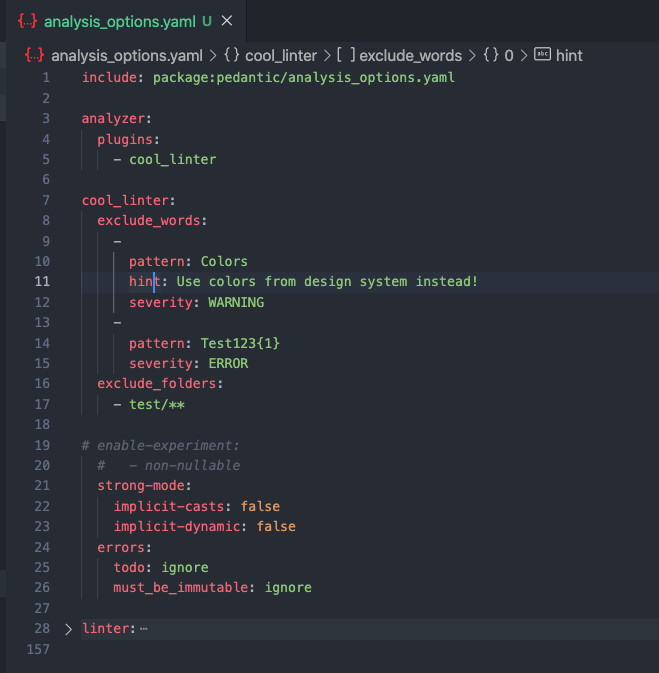

[](https://pub.dev/packages/cool_linter/)
[](https://pub.dev/packages/cool_linter/)
[](https://pub.dev/packages/cool_linter/score)

# Cool linter

  This is a custom linter [package](https://pub.dev/packages/cool_linter) for dart/flutter code. It can set linter for exclude some of words. This words you can set
  in analysis_options.yaml by example below

## Usage

### 1. Add dependency to `pubspec.yaml`

    ```yaml
    dev_dependencies:
      cool_linter: ^1.0.1 # last version of plugin
    ```

###  2. Add configuration to `analysis_options.yaml`

    ```yaml
    analyzer:
      plugins:
        - cool_linter

    cool_linter:
      always_specify_types:
        - typed_literal
        - declared_identifier
        - set_or_map_literal
        - simple_formal_parameter
        - type_name
        - variable_declaration_list
      regexp_exclude:
        -
          pattern: Colors
          hint: Use colors from design system instead!
          severity: WARNING
        -
          pattern: Test123{1}
          severity: ERROR
      exclude_folders:
        - test/**
        - lib/ku/**
    ```
1. ### always_specify_types linter:
  [always_specify_types](https://dart-lang.github.io/linter/lints/always_specify_types.html)
  This rule is like dart core linter rule, but you can choose which of this subrules want to use:
    * typed_literal
    * declared_identifier
    * set_or_map_literal
    * simple_formal_parameter
    * type_name
    * variable_declaration_list

  Also you can choose exclude folders for this rule. See `exclude_folders`

2. ### regexp_exclude linter:
  * `pattern` - RegExp-pattern, for example: Test123{1}, ^Test123$ and others
  * `severity` - [optional parameter]. It is console information level. May be WARNING, INFO, ERROR. Default is WARNING
  * `hint` - [optional parameter]. It is console information sentence
  * `exclude_folders` - this folders linter will ignore. By default excluded folders are:

  ```dart
  '.dart_tool/**',
  '.vscode/**',
  'packages/**',
  'ios/**',
  'macos/**',
  'web/**',
  'linux/**',
  'windows/**',
  'go/**',
  ```

## Attention!!!
##  You must restart your IDE for starting plugin

### 3. Result

  
  
  