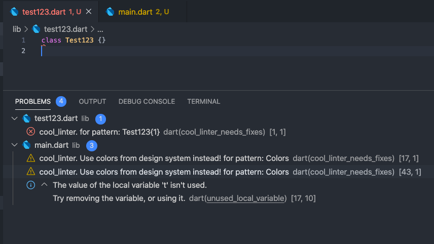
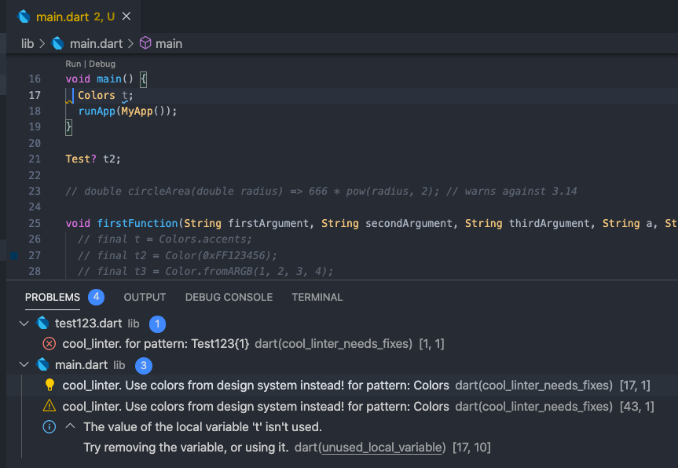
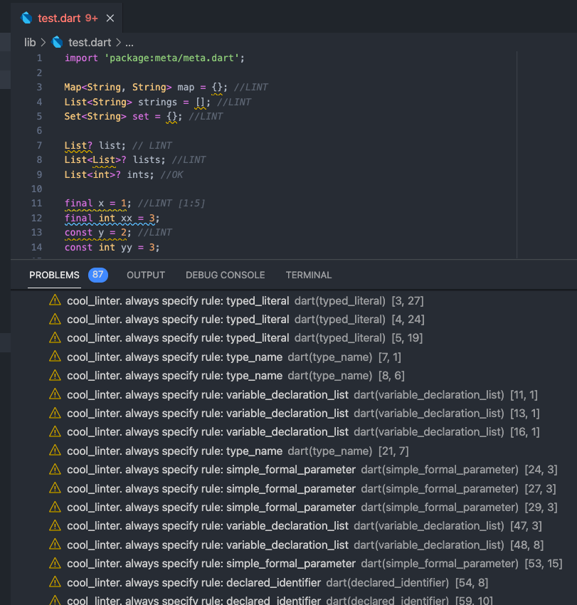

[](https://pub.dev/packages/cool_linter/)
[](https://pub.dev/packages/cool_linter/)
[](https://pub.dev/packages/cool_linter/score)

# Cool linter

  This is a custom linter [package](https://pub.dev/packages/cool_linter) for dart/flutter code. It can set linter for exclude some of words. This words you can set
  in analysis_options.yaml by example below

## Usage

### 1. Add dependency to `pubspec.yaml`

```yaml
dev_dependencies:
  cool_linter: ^1.2.0 # last version of plugin
```

###  2. Add configuration to `analysis_options.yaml`

```yaml
analyzer:
  plugins:
    - cool_linter

cool_linter:
  extended_rules:
    - always_specify_stream_subscription
  always_specify_types:
    - typed_literal
    - declared_identifier
    - set_or_map_literal
    - simple_formal_parameter
    - type_name
    - variable_declaration_list
  regexp_exclude:
    -
      pattern: Colors
      hint: Use colors from design system instead!
      severity: WARNING
    -
      pattern: Test123{1}
      severity: ERROR
  prefer_trailing_comma:
    break-on: 3
  exclude_folders:
    - test/**
    - lib/ku/**
```
1. ### **always_specify_types linter**:
  [always_specify_types](https://dart-lang.github.io/linter/lints/always_specify_types.html)
  This rule is like dart core linter rule, but you can choose which of this subrules want to use:
  * typed_literal
  * declared_identifier
  * set_or_map_literal
  * simple_formal_parameter
  * type_name
  * variable_declaration_list

  Also you can choose exclude folders for this rule. See `exclude_folders`

2. ### **regexp_exclude linter**:
  * `pattern` - RegExp-pattern, for example: Test123{1}, ^Test123$ and others
  * `severity` - [optional parameter]. It is console information level. May be `WARNING`, `INFO`, `ERROR`. Default is WARNING
  * `hint` - [optional parameter]. It is console information sentence
  * `exclude_folders` - this folders linter will ignore. By default excluded folders are:

  ```dart
  '.dart_tool/**',
  '.vscode/**',
  'packages/**',
  'ios/**',
  'macos/**',
  'web/**',
  'linux/**',
  'windows/**',
  'go/**',
  ```

3. ### extended_rules. **always_specify_stream_subscription** linter:
  Always use `StreamSubscription` for Stream.listen();

  CORRECT:

  ```dart
  final Stream<String> stream2 = Stream<String>.value('value');
  final StreamSubscription<String> sub = stream2.listen((_) {}); // OK
  ```

  WARNING:

  ```dart
  final Stream<String> stream1 = Stream<String>.value('value');
  stream1.listen((String ttt) {}); // LINT
  ```

## Attention!!!
###  You must restart your IDE for starting plugin

# 3. CLI
You can use linter as command line tool
```dart bin/cool_linter_cli.dart analyze -tsc -d test/fix/result --regexp_path test/regexp/regexp_settings_cli.yaml```

[or using dart pub run](https://pub.dev/packages/cool_linter/install)


`Available options`:
* `-d` - Folder to analyze
* `-f` - Fix issues. At now only for prefer_trailing_comma rule
* `-t` - Use always_specify_types_rule rule
* `-s` - Use always_specify_stream_subscription rule
* `-c` - Use prefer_trailing_comma rule
* `-f` - Fix issues. At now only for prefer_trailing_comma rule
* `-b` - break_on value for prefer_trailing_comma rule
* `--regexp_path` - Path to file with RegExp settings

Also you must specify ```--regexp_path``` parameter if you want to regexp analyzer.
Example: ```--regexp_path <path to regexp settings .yaml file>```

```yaml
regexp_exclude:
  -
    pattern: Colors
    hint: Use colors from design system instead!
    severity: WARNING
  -
    pattern: \sTestClass\s
    hint: Dont use TestClass
    severity: ERROR
  -
    pattern: \sTestClass2\s
    hint: Dont use TestClass2
    severity: INFO
```

# 4. Result
Example of analysis_options.yaml

```yaml
analyzer:
  plugins:
    - cool_linter

cool_linter:
  always_specify_types:
    - typed_literal
    - declared_identifier
    - set_or_map_literal
    - simple_formal_parameter
    - type_name
    - variable_declaration_list
  prefer_trailing_comma:
    break-on: 2
  regexp_exclude:
    -
      pattern: Colors
      hint: Use colors from design system instead!
      severity: WARNING
    -
      pattern: Test123{1}
      severity: ERROR
  exclude_folders:
    - test/**
    - lib/ku/**
```

  
  
  